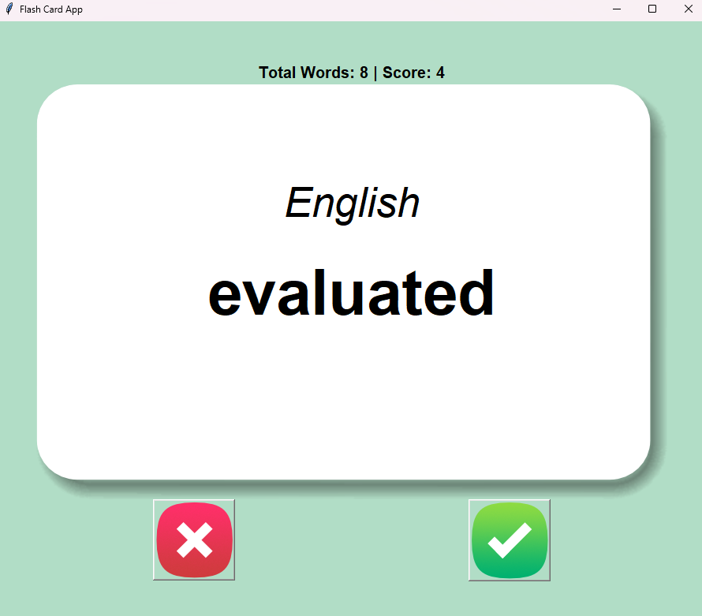

## Flash Card App

A simple Python-based flash card application to learn English-Turkish word pairs interactively using a CSV file 
and a Tkinter GUI.

### Features

- Displays an English word from a predefined CSV file.
- Reveals the Turkish equivalent after 3 seconds.
- Tracks your score when you click "Yes" for a correct answer.
- Skips to the next word when you click "No" without altering the score.

### Preview


### Installation

1. **Clone the repository:**

   ```bash
   git clone https://github.com/AenuHub/flash-card-app.git
   ```

2. **Navigate to the project directory:**

   ```bash
   cd flash-card-app
   ```

3. **Ensure Python is installed:**
   - Required Python version: 3.x

### Usage

1. **Run the application:**

   ```bash
   python main.py
   ```

2. **Exit the app by closing the window.**

## CSV File Format

The application reads data from a CSV file. Ensure the file is formatted as follows:

```csv
English,Turkish
Hello,Merhaba
World,Dünya
...
```

- **Note:** Modify the `flash_words.csv` file in the project `data` directory to add or update word pairs.

### Contribution

Feel free to fork the repository and submit pull requests for bug fixes or feature enhancements.

---

*Happy learning!*
